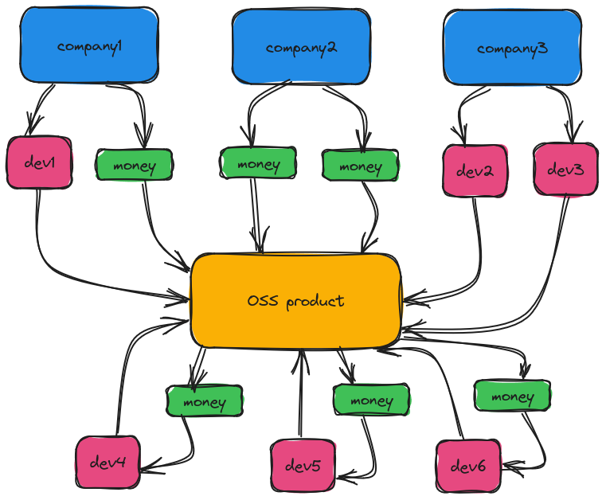

It's 11:43pm on a Monday night. My 6-week-old son is asleep in my office so my wife can get some uninterrupted rest for the first half of the night. He's finally asleep now, and I probably should be also after a full day of work. But I'm not done for the day. Even though I'm a software engineer by trade, I'm also a computer programmer by hobby and passion. So I do what I've been doing for well over a decade now: I boot up my computer to write some code.

What to do, what to do... Learn something new? Maybe. Write a blog post? Well... here I am. But... in the back of my mind I know that I have open source projects that need some attention. One happens to be heavily used. I'm nearly 3/4 million downloads, and it's something that people seem to think has some level of usefullness. Those are the good parts. The bad parts are that there's a dozen issues that I haven't even reviewed much less triaged, investigated, and fixed. There are a few PRs from the community that I need to look through. There are dependencies that need to be updated. The list goes on and on. This project has hit a not-so-uncommon OSS milestone: Maintainer burnout.

## What compels all software builders

I'm certainly not alone in my pursuits of writing software. And with the fear of overgeneralizing a massive group of us software craftspeople, I think the effort we put into software is a simple equation:

`time = passion + money`

Every hour we spend writing code is because of some combination of passion and money. Both of those can be zero, but the other part must be great enough to compensate the zeroed value. Let's see me as an example:

My job as a software engineer is great. They give me money to write code. I'm also super lucky that I have a high level of passion for the code I write and the things I build. There's also a high level of demand on my work. That's a massive win! I'm lucky. Others may have low or no passion for their work, but their compensation keeps them coming back on Monday morning at 9am. That's totally fine too!

Let's see some of my other current projects. My blog, this blog, is one of them. I don't get money, but I have a bit of passion with it and that matches the demand well enough. Then there is `passion project`, which I get no money from but I'm pretty stoked about so my motivation is pretty high. And there's no demand, so I go at my own pace and take it whatever direction I want!

And then finally, there's my `uninteresting (to me) OSS project`. What once resembled `passion project` is now unrecognizable from a motivation perspective. But the demand is high. There are lots of users, many in a corporate sense using my software to further progress their organization. And the bad news is, I get no money at all from it. So motivation is essentially nonexistent at this point. Where passion is falling short, money _could_ motivate me to routinely work on this product.

## What's really going on?

This all boils down to a situation where you have many profit-generating companies using software that some programmer volunteered to write. That software contributes to that company making even more money. But the developer sees none of it because they are just an author on some git commits, and aren't on the company's payroll.

This is Volunteering as a Service (VaaS). It is quite literally a free lunch at the expense of hard-working individuals.

That's pretty dark, so let me bring that back a little bit. It is not all companies treating OSS this way. And even the ones that are, I would be willing to bet that 99% of these companies don't neglect compensation out of malice. The OSS system is just entirely not equipped to facilitate these companies to pay contributors.

## What's the solution?

So that problem statement isn't new. It has bounced around often and in many forms. So what do _I_ think could be a solution? Open source software developers should have compensation that follows this:

`money = contributions * usage`

If you are an active contributor on a product with high utilization, the payout should reflect that. Likewise, if you've submitted a couple of commits on a product that nobody uses, the money (or lack thereof) should represent that. But it's not that simple, because there are different types of open source software developers out there. Some write OSS code as part of their employment, in which case they are likely already compensated for their contributions. It comes in their checks twice a month. But the other type of OSS developer is the one that is making those OSS contributors after hours and not affiliated with an organization.

OSS-using companies should be funding these projects. After all, they are using them. And even though they aren't forced to buy licenses from SomeClosedSourceSoftwareCompany, that doesn't mean that they _shouldn't_ be contributing.

## How can companies contribute?

The obvious answer is money. The less obvious answer is with developer time. This is quite common. Companies might have employees full or part time contributing to open source software projects. A great example of this is [Kubernetes, and all the developers that contribute to Kubernetes on company time](https://k8s.devstats.cncf.io/d/9/companies-table?orgId=1). Those companies in that list (Google, Red Hat, VMware, and Microsoft to name the top ones) _are_ contributing to the success of those projects. They're giving developer time.

When a company doesn't contribute any or enough developer time to the projects, they should be supplementing with money that is distributed to those OSS developers that _aren't_ representing their company. Enterprise compensation should resemble the following:

`compensation = developers + money`

Here's another way to look at this:

All three of these companies are responsibly contributing to the OSS product, but in different ways. `company1` contributes both money and developer time, `company2` sends just money, and finally `company3` provides adequate developers to the project. `company3` is the Googles or Microsofts of Kubernetes.

## How do dependencies get compensated?

Quick, name all the dependencies of Kubernetes. You can't, and I can't either. There's just too many. It shouldn't be only end user facing products that get appropriate compensation. It should be these products that send a portion of their contributions (money and developer time) down to these dependencies in a big happy tree of contributions.

## Why is this so hard?

There is a lot of challenges to this. And these are only the things I _thought_ of. I'm sure in reality it's even more complicated. That's why I don't think the moral reponsibility at the moment falls on these companies. There needs to be a system in place that handles the contributions from users and distributes them to projects and dependency projects. It's just too complicated to do otherwise. `company2` can wake up one day and say "I want to do the right thing and compensate OSS developers." But... uhhhh... where do they send the money to? I have no clue. There is nobody to send it to without adding a _ton_ of overhead, which isn't fair to anybody. And no, I don't think GitHub Sponsors is the answer to this.

## Summarizing

Hopefully one day we do figure out how to fairly compensate open source software builders. It's the right thing to do, and I don't know anybody (including these companies) that would argue that point. We're all in this big software world together.
