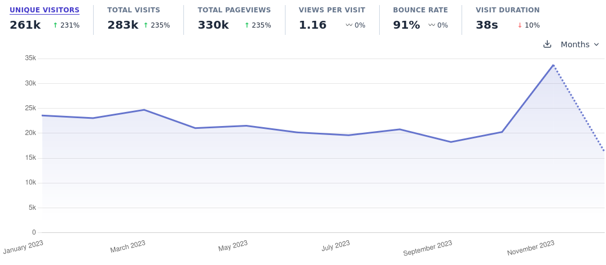
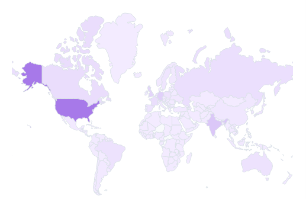

I'm sitting here on December 31st as the final hours of 2023 come to a close, and I reflect on the past twelve months of blogging. So here we are!

I had **283k visits** with **330k total pageviews**!

This was a big year for me personally where blogging took a back seat. I started a new job at a new company, I published a book, and my son was born. I wrote **22 blog posts** over the course of the year. Here are the blog posts with the most traffic:

1. (16k) [When and How to Use Helm and Kustomize Together](https://trstringer.com/helm-kustomize/)
1. (15.1k) [The Lack of Compensation in Open Source Software is Unsustainable](https://trstringer.com/oss-compensation-broken/)
1. (13.5k) [Simple vs Oneshot - Choosing a systemd Service Type](https://trstringer.com/simple-vs-oneshot-systemd-service/)
1. (12.2k) [Create a Release and Upload Artifacts with GitHub Actions](https://trstringer.com/github-actions-create-release-upload-artifacts/)
1. (11.7k) [Manual Approval in a GitHub Actions Workflow](https://trstringer.com/github-actions-manual-approval/)

On of my favorite things to see is the global reach of my blog post:

Top countries visiting my blog:

1. (73.4k) United States
1. (23.3k) India
1. (17.2k) Germany
1. (14.4k) United Kingdom
1. (8.7k) Canada

It was a great year! I'm looking forward to increasing my content output this year on the blog, so stay tuned for what's to come.
