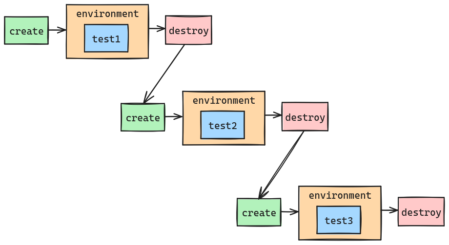
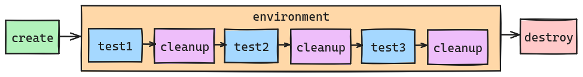
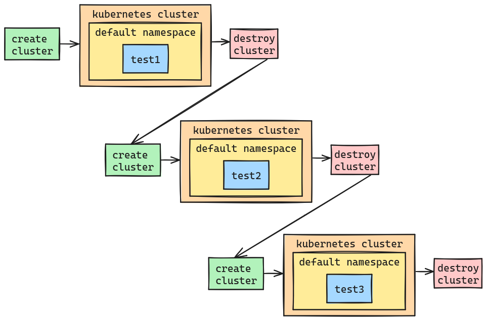
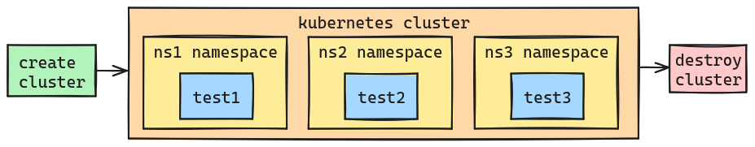
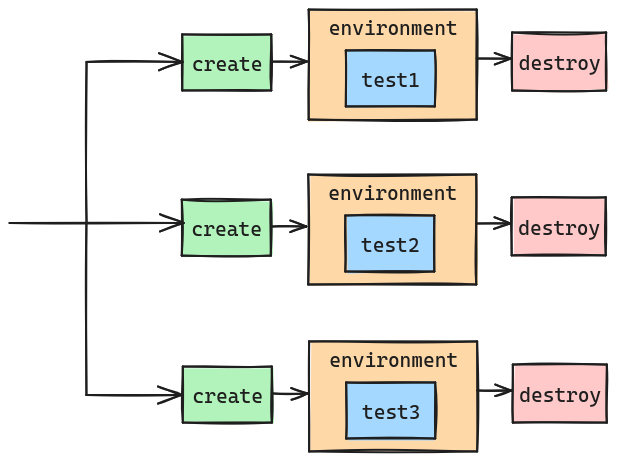

I'm a _huge_ fan of end-to-end (e2e) tests. They give me the most confidence that my software is doing what I think it should be doing in production, but they aren't without their faults. Let's take a step back first... (or just [jump to the optimization part](#optimize-your-tests) if you already know what e2e tests are, why they're great, and why they can be slow)

## What are e2e tests?

[Wikipedia's definition](https://en.wikipedia.org/wiki/Test_automation) states:

> These test the system as a whole, simulating real-world usage scenarios. They are the slowest and most complex tests.

While I think they are amazing, I do strongly agree with that second sentence. They are complex, but can oftentimes be _really_ painfully slow. Why do we care about slow tests? It's not because us software developers are impatient. As a general guideline, we want to fail fast. If you e2e test suite takes 3+ hours to run, that's anything _but_ failing fast. And if you're running your e2e tests local, that is many orders of magnitude beyond what is acceptable. Because of the inherent nature of how slow they can be, many programmers dismiss e2e tests as not worth it, or too much overhead.

## Why are e2e tests great?

I hinted at this in the opening of this post, but I think e2e tests are really great and I almost always start writing my e2e tests from the beginning of a project. There are two reasons why I think they are awesome and they should be part of _most_ software development:

1. They test the whole user experience. If you want to validate the user experience, which is the most important thing, then you have to test it all. Testing in isolation (unit tests, integration tests) is good, but doesn't cover the full experience.
1. Using e2e tests in a test driven development (TDD) approach is an effective way to define the experience _before_ writing the application code.

## Why are e2e tests so slow?

The good part of e2e tests are that they test everything. The bad part of e2e tests is that they test... everything. You need your entire application stood up. Oftentimes this means provisioning a cluster to run it on, a database instance to store the data in, cloud resources to interact with, and any other runtime dependency that your software has. This could be a _lot_. And these types of things don't get created instantaneously. Sometimes these things take minutes. If you have a few dozen e2e tests, those minutes turn into hours really fast.

## Optimize your tests

Because running a long list of e2e tests can take a long time, there are a few strategies you can take to speed this up. Note that this is a list of _options_ and possibilities, generally speaking. Some or all may not be possible or appropriate given you environment and requirements.

Let's take this scenario. We have three e2e tests that run in their own isolated test environments (that's great!), but they are taking way too long to run:

How can we speed this up?

## Environment reuse: Cleanup between tests

This is probably one of the most common approaches for e2e test optimization, so I'll put it at the top of the list. I am a big fan of not reusing environments. There are a lot of reasons to start out with a clean, fresh environment for every single test. Primarily for the reason that you won't have leftovers between tests that affect future tests. This is a leading cause of test flakiness.

_But_, if having fresh environments provisioned for every test is taking too long then you can reuse test environments between tests. Something like this:

**Advantages** - You reduce the amount of times you provision your test environment, which is usually the bulk of the duration for e2e tests.

**Disadvantages** - Test "leftovers" can cause test flakiness and false pass/fail. You have to now be intentional on cleaning up your test environment, and it's very easy to get this wrong.

I'm a big fan of making this **optional** for your e2e tests. On my local environment as I'm developing, I want the quick e2e test runs with reusing my test environment. But in my build pipeline, especially on `main`, I want to make sure that these tests are passing in isolation prior to classifying my changes as successful. I care less that my pipeline e2e test runs take long (maybe, but sometimes I also care about that a lot too).

## Environment reuse: Limit environment scope

This is very technology dependent, so how this applies to you will vary. Oftentimes we have too broad of environment isolation unnecessarily. Let's take this an example of running tests in a Kubernetes cluster:

This is great! We're ensuring that all of our e2e tests are being run in isolation by creating and tearing down a test cluster between test runs. Anybody that works with Kubernetes knows that this isn't instantaneous, even if you're using a local [kind](https://kind.sigs.k8s.io/) cluster.

This is a perfect example that we don't have to reuse the whole cluster environment, but we can narrow down the reuse scope itself. As you can see, the tests use the `default` namespace for all their runs, meaning that the namespace level is common among all tests. If we were to refactor our e2e tests so that they use their own unique namespaces, now we have narrowed the test environment isolation meaning we can narrow our environment reuse. Here's what this could look like:

Now we are only creating the Kubernetes cluster once, and each e2e test is using a different namespace to isolate their runs. Another common area that this can be applied to is databases. Instead of provisioning and tearing down a whole database instance between runs, consider reusing the instance and narrowing the scope to the database itself. Or even better yet, different schemas within the same database (although this likely requires your application to have more granular configuration, which might not be the case).

**Advantages** - Still doing environment isolation with no reuse, and these also opens the opportunity to run these tests in parallel.

**Disadvantages** - This requires you to know the scope of your tests quite well. In this example, if these tests mutate anything that is cluster-wide then this approach wouldn't be effective, as you would have to be sharing part of the environment between tests.

## Run only some tests

This one is very situation and environment dependent. Let's say you have 50 e2e tests. But the code that you're changing only impacts 10 of these e2e tests. In your pull request pipeline you could have it so that only those 10 e2e tests are run before allowing this to merge to `main`. You'll want to make sure that `main` is running all 50 of these tests though prior to creating and delivering any artifacts, and definitely before to deploying to any production-like environments.

You can also take this approach with your local tests. Make sure that your e2e test framework is designed to be able to run single tests, or a subset of tests. That way I can ensure my local inner dev loop is as quick as possible for e2e test runs as well.

**Advantages** - Only run the tests that need to be run at any given time (e.g. single test for local development, a subset of tests for a pull request gate, and all tests in `main`).

**Disadvantages** - You could break `main` in this scenario causing additional pull request churn and just overall reduced confidence in your default branch.

## Parallelize as much as possible

Running your e2e tests serially is likely the simplest way, but depending on your underlying hardware you could have the option to parallize test runs:

Unless your e2e test suite is pretty small, it's unlikely that you'll be able to kick off 100% of your e2e environments and tests in one shot. Likely you'll have to have parallel environments running in batches. As you can probably already guess, this can get complex quickly.

**Advantages** - All the benefits of isolated test environments but with runtime efficiency.

**Disadvantages** - Parallelization of tests gets very complex, especially if you're dealing with batching. This can also require a non-trivial amount of underlying hardware, which might not be available on your local development environment or your pipeline runners.

## Summary

e2e tests are great, but they can sometimes suffer from long running duration. Before you decide to _not_ write that e2e test, though, perhaps it's worth investigating one of these other performance optimizations!
