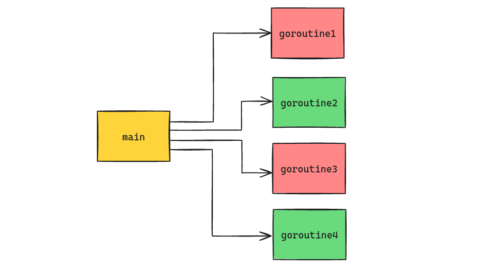

Go has a very powerful approach to concurrency. Not unlike other concurrency models, it can be challenging to handle errors. With Go, we utilize goroutines to handle our concurrent workloads. Take, for instance, this situation:



We have our `main` goroutine which starts four other goroutines. We have a couple of failures (`goroutine1` and `goroutine3`). But how do we collect and handle these errors? There are a couple of ways...

## sync.WaitGroup

It's quite common to use a `sync.WaitGroup` when working with goroutines. With this approach, it can be difficult to implement proper error handling without dealing with race conditions or deadlocked goroutines. Here's one way to accomplish this:

```go
func oddNumbersAreBad(nums <-chan int, errs chan<- error) {
	for num := range nums {
		fmt.Printf("Received num %d\n", num)
		if num%2 == 1 {
			errs <- fmt.Errorf("found odd number: %d", num)
			return
		}
	}
}

func main() {
	var wg sync.WaitGroup
	nums := make(chan int)
	errs := make(chan error)
	errsDone := make(chan struct{})

	numCount := 10

	// Collect and cache the errors.
	resultErrs := []error{}
	go func() {
		for err := range errs {
			resultErrs = append(resultErrs, err)
		}
		errsDone <- struct{}{}
	}()

	// Start worker goroutines to handle our input.
	for i := 0; i < numCount; i++ {
		wg.Add(1)
		go func() {
			defer wg.Done()
			oddNumbersAreBad(nums, errs)
		}()
	}

	for i := 0; i < numCount; i++ {
		nums <- i
	}
	close(nums)

	wg.Wait()
	close(errs)

	// Block until error caching has completed then read and handle errors.
	<-errsDone
	for _, err := range resultErrs {
		fmt.Printf("Result error: %v\n", err)
	}
}
```

Stepping through this, we create three channels:

* `nums` to provide the input to the worker goroutines
* `errs` to get any and all errors back to the `main` goroutine
* `errsDone` as a signal from the error handling goroutine to `main` that error handling is complete

We first start with spinning up the error handling goroutine:

```go
	// Collect and cache the errors.
	resultErrs := []error{}
	go func() {
		for err := range errs {
			resultErrs = append(resultErrs, err)
		}
		errsDone <- struct{}{}
	}()
```

All this does is loop through the `errs` channel and stores all of the errors in `resultsErrs`, which is just a slice of errors. We could do our error handling here, or a subset of it, but in my case I'm just using it to collect and get the errors back to the `main` goroutine.

One of the more interesting parts of the error handling goroutine is that we use `errsDone` for coordination to signal to the `main` goroutine that we have completed. Otherwise we could get in a race condition where the `main` goroutine isn't waiting on our error handling goroutine and we could miss out on errors.

Then it's time to run the worker goroutines to handle the input:

```go
	// Start worker goroutines to handle our input.
	for i := 0; i < numCount; i++ {
		wg.Add(1)
		go func() {
			defer wg.Done()
			oddNumbersAreBad(nums, errs)
		}()
	}
```

We're creating the same amount of goroutines that we have as input (this can change), and we're incrementing the `WaitGroup` and then running the goroutine. The function `oddNumbersAreBad` does nothing but outputs an error if a number is odd:

```
func oddNumbersAreBad(nums <-chan int, errs chan<- error) {
	for num := range nums {
		fmt.Printf("Received num %d\n", num)
		if num%2 == 1 {
			errs <- fmt.Errorf("found odd number: %d", num)
			return
		}
	}
}
```

The input is the channel of input numbers as well as the output channel for errors.

Then with the worker goroutines waiting on data on the `nums` channel, we start pushing our input there:

```go
	for i := 0; i < numCount; i++ {
		nums <- i
	}
	close(nums)
```

Closing the `nums` channel exits the goroutines from their input loop. Then we wait for the goroutines to exit:

```go
	wg.Wait()
	close(errs)
```

Closing the `errs` channel exits the error handling goroutine from its loop, which then closes the `errsDone` channel, where our `main` goroutine is blocking waiting for that signal:

```go
	// Block until error caching has completed then read and handle errors.
	<-errsDone
```

Then finally we can process all of the worker goroutine errors however we need to. In my case, I'm just dumping them to stdout:

```go
	for _, err := range resultErrs {
		fmt.Printf("Result error: %v\n", err)
	}
```

While this is effective, there is a lot to this solution. Let's see another way...

## errgroup.Group

Go provides a more succinct way to handle goroutine errors with the `errgroup.Group` implementation. Let's see how we can do something similar:

```go
func oddNumbersAreBad(nums <-chan int) error {
	for num := range nums {
		fmt.Printf("Received num %d\n", num)
		if num%2 == 1 {
			return fmt.Errorf("found odd number: %d", num)
		}
	}
	return nil
}

func main() {
	var eg errgroup.Group
	nums := make(chan int)

	numCount := 10

	for i := 0; i < numCount; i++ {
		eg.Go(func() error {
			return oddNumbersAreBad2(nums)
		})
	}

	for i := 0; i < numCount; i++ {
		nums <- i
	}
	close(nums)

	if err := eg.Wait(); err != nil {
		fmt.Printf("EG result error: %v\n", err)
	}
}
```

Now we only have a single channel, `nums`, because we don't need to do the collection and signaling for errors. We first create an instance of `errgroup.Group`, and then to run a goroutine with the errgroup we call `Group.Go`:

```go
	for i := 0; i < numCount; i++ {
		eg.Go(func() error {
			return oddNumbersAreBad(nums)
		})
	}
```

Our new version of `oddNumbersAreBad` doesn't need to take an error channel as input. It just returns an `error` (or `nil` in the absence of one). `Group.Go` takes a parameter of type `func() error`, which we use to call our function.

Like before, we provide the input in the nums channel and then close it:

```go
	for i := 0; i < numCount; i++ {
		nums <- i
	}
	close(nums)
```

Here's another main difference with this approach. With the errgroup we call `Group.Wait`, which returns an error:

```go
	if err := eg.Wait(); err != nil {
		fmt.Printf("EG result error: %v\n", err)
	}
```

While the collection of goroutines that are managed by the errgroup can return multiple errors, this just returns a single error (it appears like it's the last non-nil error that's returned from a goroutine).

That final point is where the `errgroup.Group` _might_ not be a good fit for your requirements: If you need _all_ of the errors that the goroutines return then you will need to do something different. But, oftentimes the goroutines are all doing the same (or similar) work, so it's common that the errors are all the same. In that case, a single error is usually a good indication of the underlying problem. But not always.

## Summary

While not simple, error handling with concurrent workloads is very important. Go gives you a few ways to approach this and hopefully this blog post has highlighted a couple of those!
