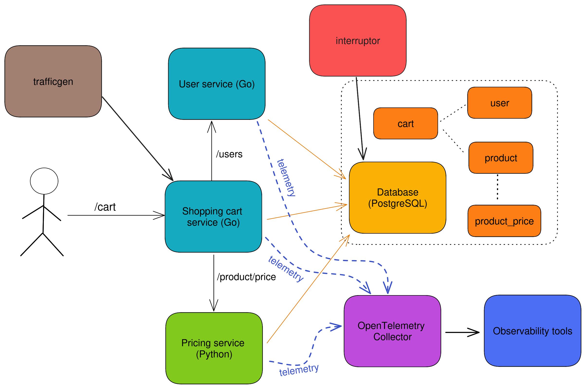

## TLDR

[OpenTelemetry shopping cart](https://github.com/trstringer/otel-shopping-cart) is repo that includes a microservices application, OpenTelemetry components, and many observability backend tools (the whole Grafana stack, Elasticsearch, Jaeger) and collects traces, metrics, and logs. This is a good everything-included (application, OpenTelemetry, observability tools) project so that you can learn, experiment, and test all things OpenTelemetry.

## Longer version

I've been using OpenTelemetry a lot these past few years. It's really great and *so* powerful. The thing is, unlike other software you can't really use OpenTelemetry in isolation. By design, it can be thought of as a glorified ETL pipeline for telemetry. You need something generating the telemetry signals, and then you need some*where* to dump them (and analyze them). So I set out to make a very much overengineered sample application: [OpenTelemetry shopping cart](https://github.com/trstringer/otel-shopping-cart). This includes a lot of components, so let's break them down...

### Application

The application itself is a microservices app that currently includes three services:

* `cart` (Go)
* `users` (Go)
* `price` (Python)

`cart` is the entrypoint to get a user's cart and add items to it. Pretty basic and straightforward, but enough code to have meaningful telemetry.

**Note**: My plan is to add more services with other languages to test and showcase instrumentation (e.g. Java and JavaScript). Currently the services are written in Go and Python.

I didn't want to stop there though. After all, an idle application doesn't generate any telemetry. So I created `trafficgen`, which generates traffic to this microservices application. Now you, the user, don't have to do anything and you'll magically have telemetry waiting for you to analyze in the tooling (more on that later). If for some reason you want to stop the traffic generation (maybe it's causing your underpowered cluster to lag) you can run `make stop-trafficgen`.

If all you ever see are the duplicates of the same traces that all run in less than 5 ms, that's not very fun. So I created the `interrupter` service, which randomly causes Quality-of-Service issues. It does this by creating long-running locks in the postgres database. Now there are some *interesting* traces that show issues with duration. This is a good starting point to seeing how you can use tracing data to find and troubleshoot production performance issues.

### OpenTelemetry

The OTel components include a custom built collector with only the components that are needed for this implementation. This is a good example of how you can use a trimmed down version of the collector, instead of the opentelemetry-collector-contrib approach.

Because we handle metrics through OpenTelemetry, this deployment includes the OpenTelemetry Target Allocator.

### Observability backend tools

Here's where things get interesting. Instead of having an opinion on what backend tools you *should* be using, this repo uses many. Tracing data is with both Jaeger and Grafana Tempo. Metrics are with the amazing Prometheus (consumed through Grafana). Logs in Elasticsearch and Grafana Loki. I'd be happy to add even more!

## Running it

There are a handful of ways to run this application. If you want to run it locally in a brand new kind cluster, you can just run `make run-local`. This will stand up the cluster and all the components.

If you already have an existing cluster, you can just install the application and tooling with `make install-app-and-tools`.

If you happen to already have your own observability tooling (maybe OpenTelemetry is already in your cluster) and you just want an application to generate telemetry then you can run `make install-app`. Conversely, if you just want the tooling then you can run `make install-tools`. And if you want to add different parts of the tooling, take a look at the `Makefile` for the `install-*` targets. Mix and match all you want!

Once this is all deployed, you probably want to actually look at telemetry. There are a lot of helper targets for port forwarding:

* `make port-forward-prometheus`
* `make port-forward-grafana`
* `make port-forward-kibana`
* `make port-forward-jaeger`

Running any of those does a `kubectl port-forward` and then you can just open your browser and navigate to the service!

## Summary

This is very much a work in progress, but I like how I can quickly experiment with OpenTelemetry and an actual application. Clone it, fork it, run it! Contributions are also very welcome!
