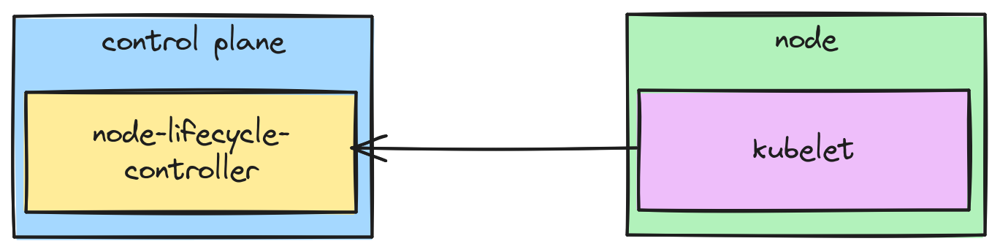

Anybody that has dealt with Kubernetes clusters for any amount of time has likely ran into a situation where they run `kubectl get nodes` and may see the infamous `NotReady` state. It's a deceivingly complex state, though, to have a node that isn't ready. It sounds obvious, but... what does "ready" even mean for Kubernetes nodes? The communication between the node and the control plane look like this:

While it might appear like the control plane is actively reaching out to the nodes, it's actually the other way around. The kubelet on each node is tasked with sending the control plane, specifically the node-lifecycle-controller, its status. And then the control plane makes the determination based off of that data it received (or _didn't_ receive!). More on that below.

So what information is the node pushing about it's readiness state? Kubelet runs the following checks:

* The container runtime network isn't ready ([source](https://github.com/kubernetes/kubernetes/blob/7f68d014e5d785472ba148c983c9d0abc6df9a36/pkg/kubelet/kubelet.go#L2894-L2896))
* The CSI provider on the node (CSINode) isn't initialized ([source](https://github.com/kubernetes/kubernetes/blob/7f68d014e5d785472ba148c983c9d0abc6df9a36/pkg/volume/csi/csi_plugin.go#L283))
* Incomplete container runtime status check ([source](https://github.com/kubernetes/kubernetes/blob/7f68d014e5d785472ba148c983c9d0abc6df9a36/pkg/kubelet/runtime.go#L108-L109))
* Container runtime itself is down ([source](https://github.com/kubernetes/kubernetes/blob/7f68d014e5d785472ba148c983c9d0abc6df9a36/pkg/kubelet/runtime.go#L110-L111))
* The pod lifecycle event generator is down ([source](https://github.com/kubernetes/kubernetes/blob/7f68d014e5d785472ba148c983c9d0abc6df9a36/pkg/kubelet/kubelet.go#L754))
* The node is shutting down ([source](https://github.com/kubernetes/kubernetes/blob/7f68d014e5d785472ba148c983c9d0abc6df9a36/pkg/kubelet/nodeshutdown/nodeshutdown_manager_linux.go#L253-L282))
* Missing CPU, memory, or max pods capacities ([source](https://github.com/kubernetes/kubernetes/blob/7f68d014e5d785472ba148c983c9d0abc6df9a36/pkg/kubelet/nodestatus/setters.go#L526-L538))

And then kubelet sends these findings to the node-lifecycle-controller. At that point, the node-lifecycle-controller takes this state (or the lack thereof) and sets the node's **Ready condition** to one of the following statuses:

* `True` - The node is ready because all of the kubelet checks from the node came back green/healthy/no errors
* `False` - The node isn't ready because one or more of the kubelet checks came back red/unhealthy/with errors
* `Unknown` - node-lifecycle-controller hasn't heard from the node's kubelet in node-monitor-grace-period time

The last status, `Unknown`, is essentially when communication between the control plane and the node has stopped.

Hopefully this blog post has explained all that goes into the node's readiness check, so the next time you see `Ready` (or the dreaded `NotReady`), you know why or what to start looking at!
