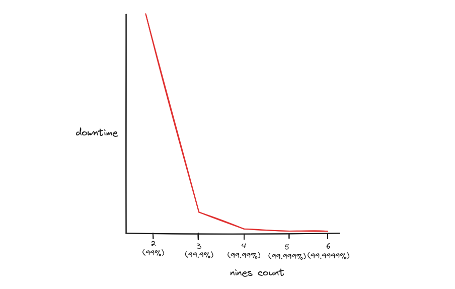
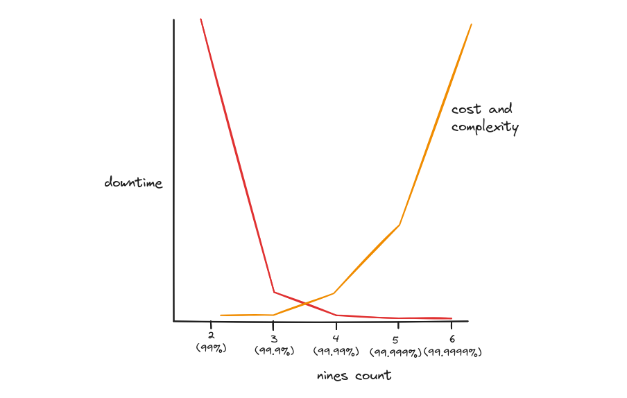

A lot of times there is an incorrect assumption that adding nines to your SLO is linear, both in gains and associated costs. Unfortunately, this idea can cause a lot of unnecessary burden on the engineers that have to build out and maintain the solution.

I'm a big fan of looking at the data, and doing the math.

**Downtime in 30 day SLO window**

| Uptime   | Nines | Downtime (minutes) |
| -------- | ----- | ------------------ |
| 99%      | 2     | 432                |
| 99.9%    | 3     | 43                 |
| 99.99%   | 4     | 4                  |
| 99.999%  | 5     | 0.4                |
| 99.9999% | 6     | 0.04               |

Going from 2 nines to 3 nines, we get a whopping gain of a little less than 400 minutes uptime. This is almost 6 and a half hours of uptime in a month, just a little shy of a full business working day. I'd say that's a pretty significant leap in uptime and reliability!

But going from 4 nines to 5 nines gives us only about a 3 minute uptime gain. Will your users even care? Will they even notice? It's helpful to visualize the gains as you start climbing the ladder of nines:

For a lot of business stakeholders, this probably isn't what they thought it would be. Much like the uptime gains, the added costs and complexity are also very much not linear:

When you start adding nines, especially beyond 3 nines, it because dramatically expensive and complex. Having less than 5 minutes of downtime over the course of a month requires a high level of redundancy, distribution, and automation. You can no longer rely on the on-call engineer to respond and mitigate to meet this SLO.

It all boils down to creating the SLOs and requirements to keep your users happy, but nothing more. Unnecessary reliability is a high cost.
