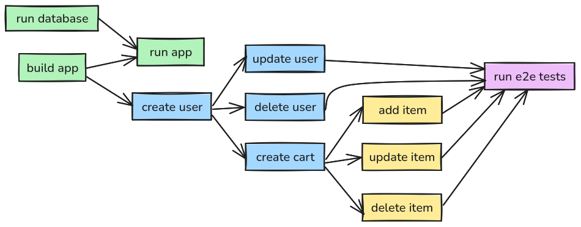

_Ok I'll admit it, the title is a bit dramatic. Makefiles and shell scripts are here to stay, and that's fine. I'm wouldn't make the argument that any tool is the perfect tool for all tasks all the time. With that disclaimer out of the way..._

When it comes to build tooling, most of us live in a world that is a Frankenstein conglomeration of Bash scripts and Make rules. That's great, until:

- Your build tooling grows beyond a few few-liners and maintenance becomes difficult
- You need to debug your scripts
- You need to use even the simplest of programming constructs, like arrays
- You need to pass in parameters to your Make targets
- ... and many, many more reasons

I'm not saying you should never use Make and shell scripts for build tooling. Sometimes your build tooling really has simple, concise, and direct requirements that never expand. But projects have this funny way of quietly growing until you find yourself dreading the thought of making the simplest changes to your build code. The cognitive overload of working on it can be a constant drain on the developer. I know this, because I've lived it more times than I'd care to remember. So I wanted to experiment with something new...

Early last year I started a personal software project and something I wanted to try was using Python (instead of bash+Make) for my build and project tooling. And wow has it exceeded my expectations. It's everything I thought it'd be and more. Here are some approaches (some related, others completely unrelated) that I took that really worked for me...

## Composable scripts

I took this initial approach and it ended up being a good bet: Separate scripts for small units of work. Let me explain. Here's the pattern I used:

**build_app.py**

```python
#!/usr/bin/python3

def build_app():
    # ... build application ...

if __name__ == "__main__":
    build_app()
```

**create_user.py**

```python
#!/usr/bin/python3

from build_app import build_app

def create_user(run_build_app=True):
    if run_build_app:
	build_app()

    # ... create user...

    return {
	"username": "newuser1",
	"favorite_animal": "dog",
    }

if __name__ == "__main__":
    create_user()
```

**update_user.py**

```python
#!/usr/bin/python3

from build_app import build_app
from create_user import create_user

def update_user(run_build_app=True):
    if run_build_app:
	build_app()

    user = create_user(run_build_app=False)
    username = user["username"]

    # ... update user ...

    return updated_user

if __name__ == "__main__":
    update_user()
```

Each unit of work (building the application, creating the user, and updating the user) is a separate Python file/module. Because of that, they can either be invoked directly (e.g. `./scripts/create_user.py`) or they can be composed as you can see in the examples above (`update_user` makes a call to `create_user` without duplicating any logic).

This turned out to be a _very_ powerful approach that essentially led to no duplicate code, and a naturally unidirectional flow of logic (no cycles in the chains).



## Quick instead of great

Something to love _and_ hate about Python is how many different ways you can write Python code. In my case here, I took two very opinionated and hard stances for my project tooling:

- No type hints
- Pass data around with dicts

Type hints have their place. And for the most part, I'm a big fan of type hints for _other_ Python code. But this is mostly just glue code, and I prioritized fast development over correct development. After all, if something is wrong then my build scripts, tests, or helper code just fail in very obviuos ways when it isn't a big deal. And I also wanted to spend most of my development effort and time on the actual software that I was building, not just the tooling.

I also chose to pass data around with dictionaries, instead of creating classes (or dataclasses). Not because this is _better_, but because it is _faster_. I don't need to create and guarantee data contracts. It's just glue code.

So this is why I choose quick over great. After all, the bar is pretty low already with shell scripts. Quick Python _is_ great already.

## Debuggable

This is a hot topic, but I'm a fan of breaking into the debugger over print debugging. It's how I've been writing code for a long time, and how I'm the most effective debugger. But with bash+Make, you don't even have that option. Best you can do is print debugging.

Python opens up a world of endless possibilies with debugging. Simply add `import pdb; pdb.set_trace()`, or the newer `breakpoint()` call to your code directly and voila... you now break into `pdb` and debug. Need conditional breakpoints? No problem. It's all code.

Breaking into the debugger was great for figuring out why a test was doing what it was doing. Python gave that to me out of the box.

## Standard library and no virtual environment

This one is a bit of a strong opinion that I hold loosely. I like just using the standard library and not having to deal with a virtual environment. But I'm not doing anything wildly unusual, so I haven't actually had a need for any 3rd party libraries. Given a requirement, I'd prefer to write a quick function myself instead of pulling down a dependency. But I would also be ok with using a virtual environment, it would just add a layer that I haven't had to consider yet. Here be dragons.

## Special attention to shelling out

Python makes hard things easy. But every once in awhile, it makes an easy thing hard. Shelling out falls in the latter category. There was a bit of pain on this, but now that I've written a couple of wrapper functions on shelling out I hope to never have to figure that out again. Here's my helper function to shell out with no output:

```python
def run_subprocess(command, level=0, env=dict(), out_file=sys.stdout):
    printi(f"⚡ {' '.join(command)}", level=level)
    all_env = dict(os.environ) | env
    p = subprocess.Popen(
        command,
        stdout=out_file,
        stderr=out_file,
        env=all_env,
    )
    p.communicate()
    return p.returncode
```

For now, ignore the special printing with `printi`. I'll cover that next. This just shells out and returns the response code. Sometimes we need to capture output though:

```python
def run_subprocess_with_output(command, env=dict(), level=0):
    tmp_filename = "/tmp/ccc.tmp"
    with open(tmp_filename, "w") as f:
        return_code = run_subprocess(command=command, env=env, out_file=f, level=level)
    with open(tmp_filename, "r") as f:
        output = f.readlines()
    os.remove(tmp_filename)

    return return_code, "".join(output)
```

This makes a call to the above `run_subprocess` function, but uses a temporary file to handle output. Oftentimes when testing my API, I want to capture the JSON output and then parse it to check for correctness.

## Output logging is critical

This was a big lesson quickly learned. With all of these composed scripts running, it quickly turned into a wall of Matrix-like text. When something failed (or succeeded), it was near impossible to figure out what exactly it was and what was happening. I refactored my output logging and turned the experience from awful to delightful:

1. Indentation - When a script called another script, all of the callee's output needs to be indented. The result is a very obvious tree of hierarchical invocations.
1. Emojis - I'm usually a very critical user (and consumer) of emojis in the terminal. In this case, it makes it possible to quickly identify things without having to read the actual text. This, in turn, makes consuming a lot of logs very quick when trying to narrow in on something specific.
1. Verbose logging - Always show 1) When a script starts, 2) when it finishes (and if it succeeds or fails), 3) when and what you shell out, and 4) when an action is skipped.

Here's an example output that shows all three of them:

```bash
$ ./scripts/test_e2e_all.py
🍕 test_e2e_all
  🍕 build_app
  ⚡ go build -o ./dist/my-app ./cmd/my-app
  ✅ build_app
  🍕 user_create
    🍕 build_app
    ⚠️ Skipping build_app
  ⚡ ./dist/my-app do-something-cool
  {"message": "this is great"}
  ✅ user_create
✅ test_e2e_all
```

The script `test_e2e_all` invokes `build_app`, so it indents all of the output. This is accomplished by creating a shared helper function:

```python
def printi(message, level=0, end="\n"):
    new_message = level * "  " + message
    print(new_message, end=end)
```

So now every script should pass through the `level` and incrementing it:

**test_e2e_all.py**

```python
def test_e2e_all(level=0):
    printi("🍕 test_e2e_all", level=level)
    build_app(level=level+1)
    # ... code omitted ...
```

**user_create.py**

```python
def user_create(run_build_app=True, level=0):
    printi("🍕 test_e2e_all", level=level)
    build_app(level=level+1)
    # ... code omitted ...
```

**build_app.py**

```python
def build_app(run_build_app=True, level=0):
    printi("🍕 build_app", level=level)
    # ... code omitted ...
```

By injecting `run_build_app` throughout, this can help guarantee we're only doing singleton operations only once, but also providing flexibility depending on which script you invoke it with.

## Shared helper functions

In my `./scripts` dir, I maintain a set of helper functions in `shared.py`. This is the random drawer of utility functions that can be used in whatever scripts that need them. We've already seen a few, like `printi`, `run_subprocess`, and `run_subprocess_with_output`. Here are some other ones...

Failure is a normal, common, and expected behavior in build tooling. Tests fail, builds fail, assertions fail. Failures themselves aren't the problem, but when they are hidden, buried, or hard to grep for it can turn an experience sour real fast. I like to have this experience consistent and easy to call:

```python
def fail(action_name, msg="", level=0):
    failure_message = f"💥 {action_name}"
    if msg != "" and msg is not None:
        failure_message = f"{failure_message} - {msg}"
    printi(failure_message, level=level)
    sys.exit(1)
```

It's not much more than a wrapper around `printi` and `sys.exit`, but it makes it a no-brainer to call in the many sad code paths throughout the scripts.

Like I mentioned above, I pass around dicts quite a bit so when I'm shelling out and getting some JSON output, I want to be able to assert that they are equal:

```python
def assert_equal(action_name, actual, expected, level=0):
    for k, v in expected.items():
        if actual[k] != v:
            fail(action_name, msg=f"Key {k} expected {v}, got {actual[k]}", level=level)
```

But sometimes I just want to test if a _sample_ is equal. For instance, if there is a list of items but I don't want to test for total equality, just individual items:

```python
def assert_equal_sample(action_name, actual, expected, field_name_identifier, level=0):
    for ei in expected:
        found = False
        for ai in actual:
            if ei[field_name_identifier] == ai[field_name_identifier]:
                found = True
                assert_equal(action_name, ai, ei, level)
        if not found:
            fail(
                action_name,
                msg=f"Field {field_name_identifier} from expected '{ei[field_name_identifier]}' not found in actual",
                level=level,
            )
```

In my particular software, datetimes are a large part of my sample/test data, as well as my validations, so I added a few helper functions:

```python
def current_unix_time():
    return int(datetime.now(UTC).timestamp())


def date_to_unix(year, month, day):
    return int(datetime(year, month, day).timestamp())
```

These are only one-liners, but it saved me from having to remember the implementation details every single time.

## Summary

It was a successful experiment, and a little extra effort has made very maintainable build tooling for this project. There's just a _little_ work to do upfront (although next time it will be less because of this work already done, and hopefully any of you readers don't need to reinvent some of these wheels), but it ended up being a big investment for the future of the project.

Do I think I will never have to write, read, or maintain build tooling in Make and Bash anymore? Definitely not, it's too ingrained in existing codebases and the industry as a whole. But next time I start another project and need to start building project tooling boilerplate, this will certainly be something I consider using again.
